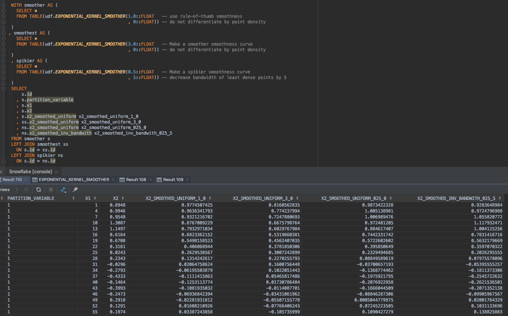
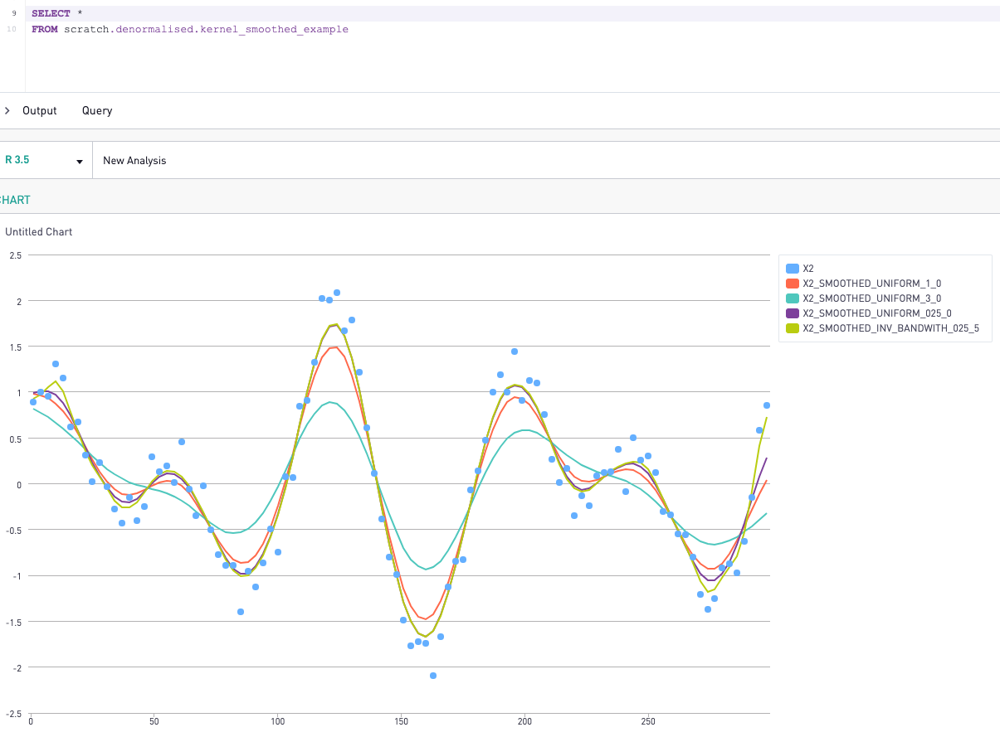
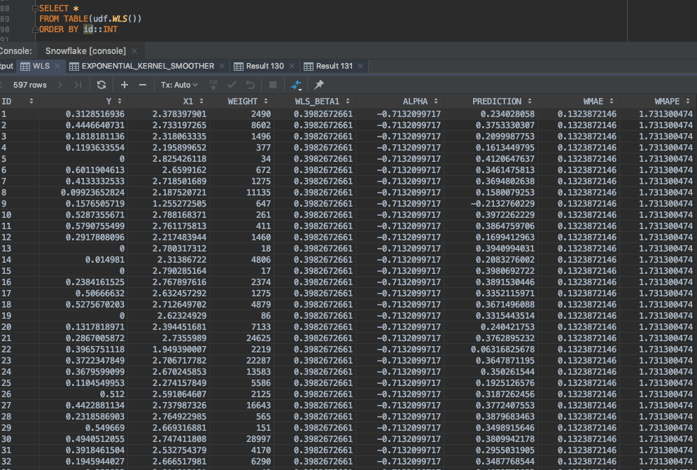
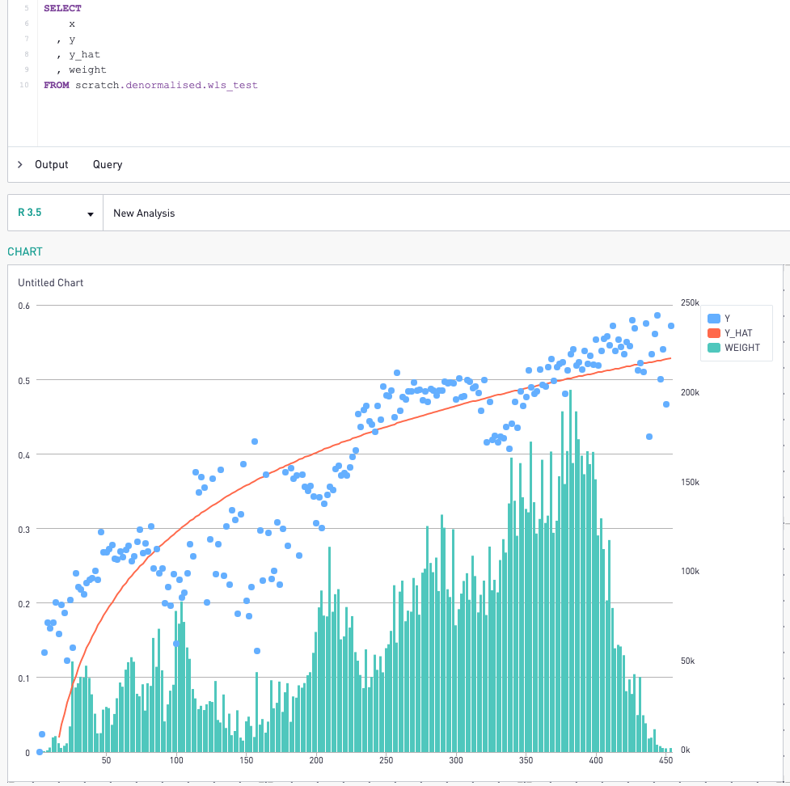
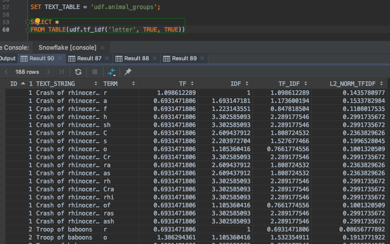
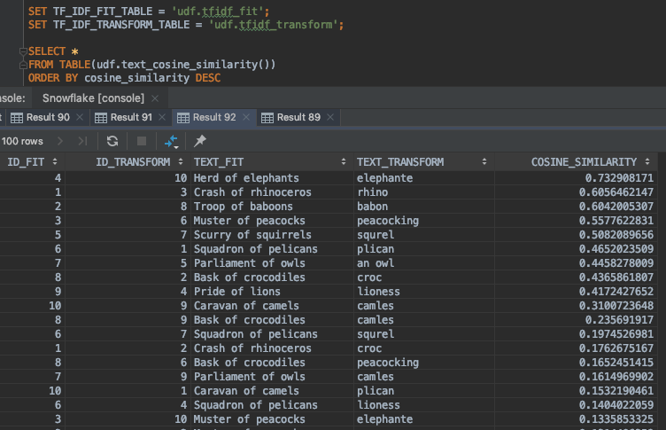

<h1>SQL Analytics</h1>

This is a repository to show that analytical things can be done in SQL :P
All are written as user-defined functions (UDFs) compatible with snowflake.

<a href = "https://github.com/chris-kelly/sql_analytics/blob/master/ARIMA.sql"><h3>RBF Kernel smoothing UDFs:</h3></a>
<ul>
<li>Calculates the gaussian kernel (1D) - used in anomaly detection</li>
<li>Can choose the level of smoothing to apply (includes 'rule-of-thumb' measure)</li>
<li>Can proportionally decrease smoothness at edges by decreasing sigma by euclidean similarity</li>
</ul>

 
 

 

<a href = "https://github.com/chris-kelly/sql_analytics/blob/master/WLS.sql"><h3>Weighted Least Squares UDFs:</h3></a>
<ul>
<li>Calculates the alpha and beta required for a univariate weighted least squares regression</li>
<li>UDFs include partition windows so multiple models can be trained on different cuts of the same table (and tested on other cuts!)</li>
<li>Added example comments to show how to extend to multivariate regressions if required (note in the example below, the x1 value has been log transformed for the beta calc)</li>
<li>Also includes MAE and MAPE calculations to assess performance on training data</li>

</ul>

 
 

 

<a href = "https://github.com/chris-kelly/sql_analytics/blob/master/TFIDF_CosineSimilarity.sql"><h3>TF-IDF, Cosine Similarity UDFs between sets of strings:</h3></a>
<ul>
<li>Calculates the cosine similarity between every combination of two tables of strings.</li>
<li>It fits TF-IDF for tokenisation (unigram, bigram, trigram)</li>
<li>It then takes advantage of L2-normalisation as a cheeky math hack to use a linear kernel instead to calculate cosine similarity.</li>
<li>So it essentially just creates a sum product on the left-join to get a dot product :D</li>
</ul>

 
 

 

